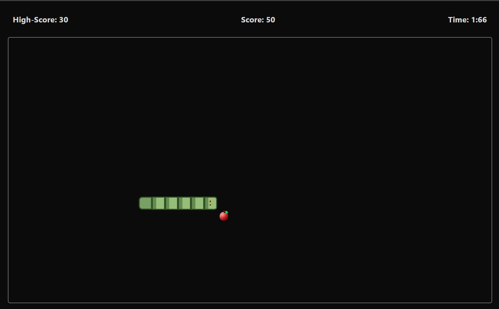
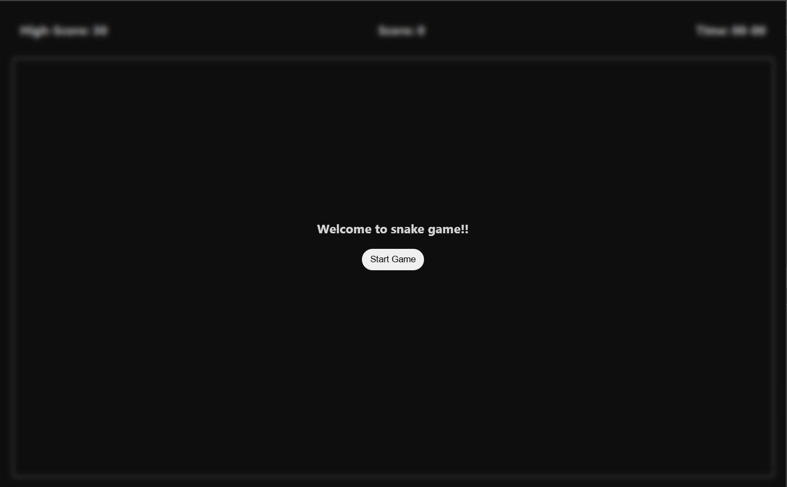
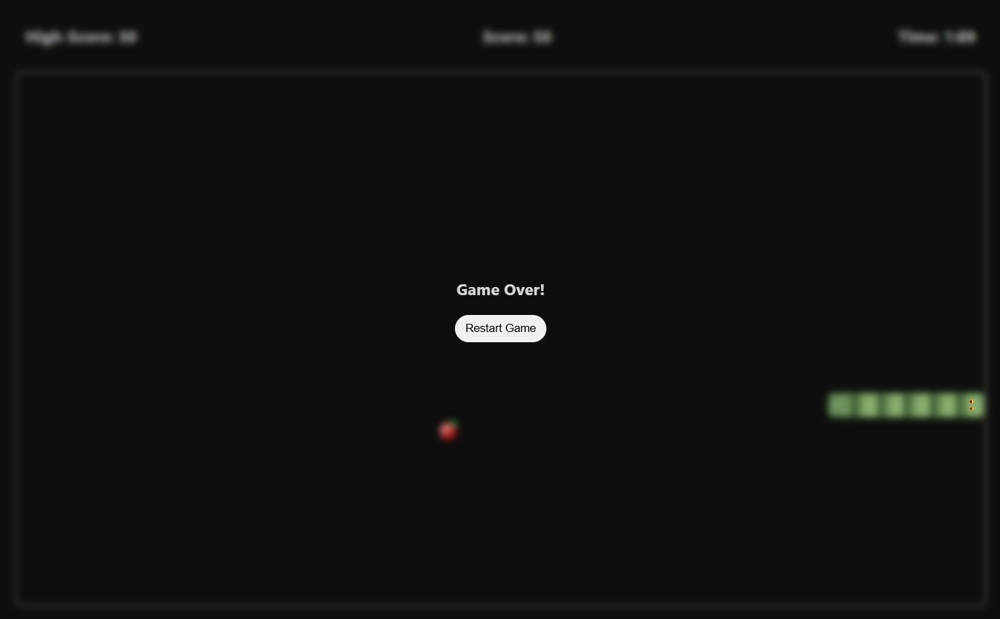

# 🐍 FaFa Snake Game

A modern, pixel-art styled implementation of the classic Snake game built with vanilla JavaScript. This project was created to improve logical thinking and DOM manipulation skills in JavaScript.

<div align="center">
  
</div>

## 🎮 Learnt From

[Watch Tutorial Video](https://youtu.be/SFLs1fYb5QA?si=5tHVGG_rcjMydst7) - *Inspired by Shreiyan Coding School*

## ✨ Features

- **Classic Snake Gameplay** - Navigate the snake to collect food and grow longer
- **Pixel Art Design** - Retro-inspired visual style with custom snake and apple graphics
- **Progressive Difficulty** - Game speed increases as you score more points
- **High Score Tracking** - Your best score is saved in local storage
- **Smooth Animation** - Game loop using `requestAnimationFrame` for consistent performance
- **Responsive Controls** - Arrow keys for directional movement
- **Sound Effects** - Audio feedback when eating food
- **Timer System** - Track how long you've been playing
- **Collision Detection** - Game ends when hitting walls or yourself

## 🎯 Gameplay

- Use **Arrow Keys** to control the snake's direction
- Collect the red apples to grow and increase your score
- Avoid hitting the walls or your own body
- Each apple gives you **10 points**
- Speed increases every 10 points (max speed cap applied)

## 🛠️ Technologies Used

- **HTML5** - Structure and layout
- **CSS3** - Styling with custom properties and animations
- **Vanilla JavaScript** - Game logic and DOM manipulation
- **Local Storage API** - High score persistence

## 📁 Project Structure

```
fafa-snake-game/
│
├── index.html          # Main HTML structure
├── style.css           # Styling and visual design
├── script.js           # Game logic and mechanics
├── FAAAH!.mpeg        # Sound effect for eating food
├── img/        # Game screenshots
│   ├── start.png
│   ├── gameplay.png
│   └── gameover.png
└── README.md          # Project documentation
```

## 🚀 Getting Started

### Prerequisites

- A modern web browser (Chrome, Firefox, Safari, Edge)
- No additional dependencies required!

### Installation

1. Clone the repository
```bash
git clone https://github.com/AmoghPuthanikar/fafa-snake-game.git
```

2. Navigate to the project directory
```bash
cd fafa-snake-game
```

3. Open `index.html` in your browser
```bash
# On macOS
open index.html

# On Linux
xdg-open index.html

# On Windows
start index.html
```

Or simply double-click the `index.html` file.

## 🎨 Key Features Breakdown

### Dynamic Speed System
The game implements a progressive difficulty system where:
- Starting speed: 420ms per frame
- Speed increases by 15ms for every 10 points scored
- Minimum speed cap: 90ms (prevents game from becoming impossible)

### Pixel-Perfect Collision Detection
```javascript
// Wall collision
if (head.x < 0 || head.x >= rows || head.y < 0 || head.y >= cols)

// Food collision
if (head.x == food[0].x && head.y == food[0].y)
```

### Smooth Animation Loop
Uses `requestAnimationFrame` with a delta-time accumulator for consistent frame rates across different devices.

## 🎓 Learning Outcomes

This project helped develop skills in:

- **Game Loop Architecture** - Understanding frame-based rendering and update cycles
- **DOM Manipulation** - Dynamically creating and styling grid elements
- **Event Handling** - Managing keyboard inputs and preventing invalid moves
- **State Management** - Tracking game state, score, and snake position
- **CSS Animations** - Creating visual effects with pure CSS
- **Local Storage** - Persisting data across browser sessions
- **Collision Detection** - Implementing boundary and self-collision logic

## 🐛 Known Issues

- Sound file path (`FAAAH!.mpeg`) needs to be verified
- Game continues to accept input during game over screen briefly

## 🔮 Future Enhancements

- [ ] Add mobile touch controls
- [ ] Implement difficulty levels (Easy, Medium, Hard)
- [ ] Add pause functionality
- [ ] Create power-ups (speed boost, invincibility, etc.)
- [ ] Add obstacles and different game modes
- [ ] Implement leaderboard with multiple high scores
- [ ] Add theme customization options
- [ ] Create different food types with varying point values

## 💡 Inspiration

This project was inspired by and learned from [Shreiyan Coding School's Snake Game Tutorial](https://youtu.be/SFLs1fYb5QA?si=5tHVGG_rcjMydst7).

## 📸 Screenshots

<div align="center">
  
| Start Screen | Gameplay | Game Over |
|:------------:|:--------:|:---------:|
|  |  |  |
| Welcome screen with start button | Active gameplay with score tracking | Game over screen with restart option |

</div>

## 🤝 Contributing

Contributions, issues, and feature requests are welcome! Feel free to check the [issues page](https://github.com/AmoghPuthanikar/fafa-snake-game/issues).

1. Fork the project
2. Create your feature branch (`git checkout -b feature/AmazingFeature`)
3. Commit your changes (`git commit -m 'Add some AmazingFeature'`)
4. Push to the branch (`git push origin feature/AmazingFeature`)
5. Open a Pull Request

## 📝 License

This project is open source and available under the [MIT License](LICENSE).

## 👨‍💻 Author

**Amogh Puthanikar**

- GitHub: [@AmoghPuthanikar](https://github.com/AmoghPuthanikar)
- LinkedIn: [amoghputhanikar](https://linkedin.com/in/amoghputhanikar)

## 🙏 Acknowledgments

- Thanks to [Shreiyan Coding School](https://youtu.be/SFLs1fYb5QA?si=5tHVGG_rcjMydst7) for the educational content and inspiration
- Classic Snake game for the timeless gameplay inspiration
- The web development community for continuous learning resources

---

<div align="center">

⭐ **Star this repo if you found it helpful!** ⭐

Made with ❤️ and JavaScript

</div>